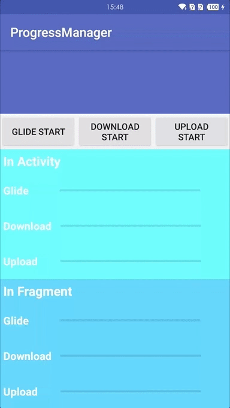

# ProgressManager
[](https://jitpack.io/#Blankyn/ProgressManager)


## Listen the progress of  downloading and uploading in Okhttp (compatible Retrofit and Glide).


## Overview



## Introduction
**ProgressManager** 一行代码即可监听 **App** 中所有网络链接的上传以及下载进度,包括 **Glide** 的图片加载进度,实现原理类似 **EventBus**,你可在 **App** 中的任何地方,将多个监听器,以 **Url** 地址作为标识符,注册到本框架,当此 **Url** 地址存在下载或者上传的动作时,框架会主动调用所有使用此 **Url** 地址注册过的监听器,达到多个模块的同步更新.

> [**框架的构思和实现可以看这篇文章**](https://juejin.im/post/593d85e55c497d006b90433d)

## Feature
* 使用简单,只需一行代码即可实现进度监听.
* 多平台支持,支持 **Okhttp** , **Retrofit** , **Glide** ,使用 **Okhttp** 原生 **Api** ,不存在兼容问题.
* 低耦合,实际请求端和进度接收端并不存在直接或间接的关联关系,即可以在 **App** 任何地方接收进度信息.
* 侵入性低,使用本框架你并不需要更改之前进行上传或下载的代码,即使用或不使用本框架并不会影响到原有的代码.
* 多端同步,同一个数据源的上传或下载进度可以指定多个不同的接收端,少去了使用 **EventBus** 实现多个端口同步更新进度.
* 支持多文件上传.
* 支持 **URL** 重定向.
* 自动管理监听器,少去了手动注销监听器的烦恼.
* 默认运行在主线层,少去了切换线程的烦恼.
* 轻量级框架,不包含任何三方库,体积极小.

## Download
### Step 1. Add it in your root build.gradle at the end of repositories:


```	groovy
   allprojects {
		repositories {
			...
			maven { url 'https://jitpack.io' }
		}
	}
```

### Step 2. Add the dependency

``` groovy
   dependencies {
      implementation 'com.github.Blankyn:ProgressManager:1.0.0'
   }
```

## Usage
### Step 1
``` java
 // 构建 OkHttpClient 时,将 OkHttpClient.Builder() 传入 with() 方法,进行初始化配置
 OkHttpClient = ProgressManager.getInstance().with(new OkHttpClient.Builder())
                .build();
```

### Step 2
``` java
 // Glide 下载监听
 ProgressManager.getInstance().addResponseListener(IMAGE_URL, getGlideListener());


 // Okhttp/Retofit 下载监听
 ProgressManager.getInstance().addResponseListener(DOWNLOAD_URL, getDownloadListener());


 // Okhttp/Retofit 上传监听
 ProgressManager.getInstance().addRequestListener(UPLOAD_URL, getUploadListener());
```


## ProGuard
```java
 -keep class me.blankm.progressmanager.** { *; }
 -keep interface me.blankm.progressmanager.** { *; }
```


## 特别鸣谢
>
> 感谢[JessYanCoding](https://github.com/JessYanCoding)项目代码
>


## License
```
 Copyright 2021, blankm

   Licensed under the Apache License, Version 2.0 (the "License");
   you may not use this file except in compliance with the License.
   You may obtain a copy of the License at

       http://www.apache.org/licenses/LICENSE-2.0

   Unless required by applicable law or agreed to in writing, software
   distributed under the License is distributed on an "AS IS" BASIS,
   WITHOUT WARRANTIES OR CONDITIONS OF ANY KIND, either express or implied.
   See the License for the specific language governing permissions and
   limitations under the License.
```
